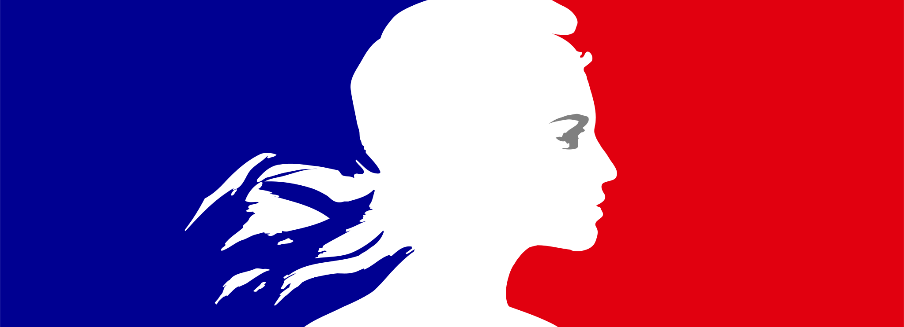

```{r setup, include=FALSE}
knitr::opts_chunk$set(echo = FALSE)
```

::: {#titlepage}


:::: {#bloc-marianne}


## INTITULÉ <br/>OFFICIEL


::::


:::: {#header}

# La démarche PROPRE

## Et s’il existait un outil mutualisé, presque clef en main, qui permettrait aux DREAL/DEAL de publier périodiquement leurs analyses de façon homogène dans des délais raccourcis ?


::::


<!--  -->


:::

 


:::{.page2}

::::{.header}
## La thérorie et la pratique

Qui cherche à faire quoi, et comment.  ex anim duis cupidatat ea exercitation. Aute officia sit magna non aute Lorem. Tempor occaecat proident proident irure Lorem veniam exercitation aliqua sunt sit occaecat eiusmod aliqua commodo.
::::

::::{.sub}


### Open Source au cœur. 
Open source = service public 2.0 (lololol);
État qui veut mettre toute ses innovations en licence open source
Ullamco esse do dolore sint labore duis ipsum dolore culpa irure et quis. Cupidatat nisi nisi pariatur cillum ut exercitation anim. Voluptate fugiat magna do deserunt aliquip quis occaecat tempor ipsum incididunt veniam occaecat esse labore.
Voluptate aute culpa enim officia voluptate in ea sunt. Enim magna enim nisi sunt. Esse aliqua proident adipisicing nisi eiusmod labore. Labore consequat nisi dolor cillum ea. Ea aliqua culpa ex dolore in esse proident. Reprehenderit commodo sint do adipisicing cupidatat culpa minim enim reprehenderit sint id. Adipisicing cillum adipisicing tempor duis officia do aute ullamco adipisicing pariatur minim ut incididunt excepteur.
::::

::::{.sub}


### Délais raccourcis
Voluptate aute culpa enim officia voluptate in ea sunt. Enim magna enim nisi sunt. Esse aliqua proident adipisicing nisi eiusmod labore. Labore consequat nisi dolor cillum ea. Ea aliqua culpa ex dolore in esse proident. Reprehenderit commodo sint do adipisicing cupidatat culpa minim enim reprehenderit sint id. Adipisicing cillum adipisicing tempor duis officia do aute ullamco adipisicing pariatur minim ut incididunt excepteur.

::::

::::{.sub}


### La forge
- les outils :
Ullamco esse do dolore sint labore duis ipsum dolore culpa irure et quis. Cupidatat nisi nisi pariatur cillum ut exercitation anim. Voluptate fugiat magna do deserunt aliquip quis occaecat tempor ipsum incididunt veniam occaecat esse labore.

::::

::::{.sub}


### La forge

Ullamco esse do dolore sint labore duis ipsum dolore culpa irure et quis. Cupidatat nisi nisi pariatur cillum ut exercitation anim. Voluptate fugiat magna do deserunt aliquip quis occaecat tempor ipsum incididunt veniam occaecat esse labore.
Voluptate aute culpa enim officia voluptate in ea sunt. Enim magna enim nisi sunt. Esse aliqua proident adipisicing nisi eiusmod labore. Labore consequat nisi dolor cillum ea. Ea aliqua culpa ex dolore in esse proident. Reprehenderit commodo sint do adipisicing cupidatat culpa minim enim reprehenderit sint id. Adipisicing cillum adipisicing tempor duis officia do aute ullamco adipisicing pariatur minim ut incididunt excepteur.

::::

:::

:::{.page3}
## titre de la page 3

Concept à déployer

- changement de méthode de travail
- la forge
- meilleure collaboration (responsabilisation du contenu)
- anticipation des problèmes 
- les utilisateurs 
:::


:::{.page4}
## pour aller plus loin

### Glossaire (marche en note de colonnes.)

 
::::{.colophon}

### Colophon

Ce document a été fabriqué ....


::::

:::


```{js, echo=FALSE}
PagedConfig.auto=true;
```


# La démarche PROPRE

Et s’il existait un outil mutualisé, presque clef en main, qui permettrait aux DREAL/DEAL de publier périodiquement leurs analyses de façon homogène et dans des délais raccourcis ?

---

## Innover dans les processus de publications

Pour réaliser ses publications statistiques, le datalab de la DREAL Pays de la Loire s'est équipé depuis 2015 de méthodes de travail telles que le Design Thinking et l'agilité. Il a également positionné R, langage de programmation statistique open source, au coeur des exploitations des données collectées, sécurisées et structurées en son sein pour adresser ses missions. En opérant le pivot d'une culture de la donnée vers une culture logicielle avec R, il se dote de PROPRE pour PROcessus de Publications REproductibles et métamorphose son métier.    


 
### Rapide et intégré

La démarche repose sur une adapation à la publication d'analyses statistiques - en ligne sous forme de pages ou d'applications interactives- des principes de développement logiciel dits DevOps. Cette approche prône un continuum entre les Dev (chargés de développer de nouvelles solutions, d'innover) et les Ops (garants de l'intégrité des systèmes, de sa stabilité) en plaçant l'utilisateur au coeur de ses préoccupations des uns et des autres. C'est une coopération de fait où chacun des maillons prend sa part de responsabilité en se préoccupant de ce qui se passe en aval. R est particulièrement adapté à une approche intégrée de la donnée : tout peut être programmé dans ce même langage, de la collecte à la communication sur le web.  


### Clé en main

La brique fonctionnelle utilisée dans PROPRE est le *paquet R* comme support de la publication pour ses propriétés autoportantes. Il contient en son sein les fonctionnalités, la documentation et les tests qui lui confèrent intégrité, maintenabilité et pérénnité. Il devient une solution "sur étagère", prête à l'emploi. L'aptitude à concevoir des paquets R est une nouvelle compétence pour les agents, transposables dans ses principes à d'autres développements logiciels.  

(un schéma DevOps avec un paquet qui "circule" dessus ?)


### Mutualisé

L'objet produit dans la démarche PROPRE concentre le fruit d'une intelligence collective, en lien avec les usages et les métiers des agents. L'utilisabilité du paquet R est maximisée par son caractère standard et sa maintenabilité est partagée entre tous les acteurs. R devient une "langue" commune, facilitatrice de logiciels. Un nombre réduit d'agent peut factoriser des fonctionnalités qui bénéficie à un plus grand nombre.    

### Réactif et prédictif

Les contenus peuvent être élaborés en parallèle de leur mise en forme : en respectant le principe de séparation des préoccupations, c'est une chaîne de publication réactive bénéficiant d'une mise en forme automatisée qui est construite. Une mise à jour du fond présentera un résultat toujours homogène dans sa mise en forme. Une mise à jour de la mise en forme pourra être répercutée sur tous les contenus. Les tests, intrinsèques à la démarche, enrayent d'éventuels effets de bord. 

---

Un cas d’école illustratif et exemplaire : le répertoire du parc locatif social


### Des méthodes de travail responsabilisantes et bienveillantes

Deux équipes se sont coordonnées pour construire un outil qui puisse ébaucher une publication en la peuplant de graphiques et tableaux minimums. L'équipe éditoriale passait commande aux développeurs qui implémentaient et livraient en continu.  Les deux parties se sont passé le témoin de nombreuses fois en mobilisant tout à tour des compétences sur la source des données, sur la problématisation éditoriale, sur la sémiologie graphique, sur l'animation d'équipe... et bien sûr en R. 


### la forge logicielle 

La *forge logicielle* est le lieu de façonnage des publications. Elle est centrée sur l'outil qui monitore et sécurise les modifications du code en conservant les différentes versions. C'est *l'intégration continue* qui permet de simuler à chaque modification l'assemblage de lignes de code pour vérifier la conformité du résultat aux attentes. La forge ne pourrait fonctionner sans outils de communication - synchrones et asynchrones - entre les opérateurs à l'oeuvre.  

### Anticipation des difficultés

C'est à la fois les outils, les méthodes et l'organisation des acteurs animant la forge logicielle qui permet de détecter très précocement d'éventuelles anomalies. Fraîcheur et traçabilité des informations au sein de la forge logicielle sont au coeur de la démarche. La communication entre les parties prenantes se fait ainsi en bienveillance, de façon responsable et solidaire et ce dès la conception.  

### Les utilisateurs 

Les destinataires des publications issues de la forge sont au coeur des préoccupations et sont prescripteurs des futures évolutions et développements. Leurs retours à l'utilisation des produit issus de la forge font aussi l'objet d'une approche intégrée dès la conception. 

### Quelques chiffres

- 7 DREAL mobilisées
- 1 agent du SDES impliqué
- 4,9 k messages asynchrones
- 5 réunions synchrones
- une forge publique qui compte un projet déployé et un guide de publication
- 146 tickets (dont 114 clos) et 215 commits pour `{propre.rpls}`
- 166 demandes de rapatriement de code validé (merge request)
- deux versions du paquet `{propre.rpls}`
- un couverture du code par les tests de 96 %


---

## PROPRE, le workflow dont vous êtes le héros

L'essence de la démarche PROPRE réside dans la traque impitoyable et inflexible du clic de souris car non traçable et non reproductible.  


### un processus long, complexe et sujet à erreur


- Se rendre sur un site de partage de données (type open data)

- Télécharger dans un répertoire plusieurs séries de données correspondant à plusieurs millésimes

- Déplacer les données dans un répertoire de travail ad hoc

- Tenter d’ouvrir des données csv d’un millésime dans Excel

- Constater que les virgules font office de séparateur de milliers et le point de séparateur décimal

- Ouvrir le document dans un éditeur de texte pour y effectuer un rechercher-remplacer

- Ouvrir avec le succès le document dans Excel

- Réitérer les opérations pour les autres millésimes

- Réaliser les transformations et manipulations à l’aide d’onglets, formules, copier-coller disséminés dans l’ensemble du classeur

- Tracer les graphiques à des fins exploratoires

- Tracer les graphiques à des fins de communication

- Réitérer pour les autres millésimes et constater que certaines données manquent, certains graphiques ne sont pas pertinents, certains tableaux incomplets (parce que données manquantes, modalités incomplètes…)

- Ouvrir un document Word, commencer à rédiger, y copier-coller les graphiques et tableaux désirés

- Envoyer le document à ses collègues/supérieurs pour révision

- Recevoir le suivi de modification

- Opérer des changements dans le fichier Excel

- Copier-coller les modifications dans le fichier Word

- Être notifié (dans le meilleur des cas) d’une modification dans le fichier source

- Se sentir découragé et inefficace (à raison) à l’idée de devoir tout recommencer.

vs 

### un processus plus technique mais plus reproductible car scripté en R

- Créer un nouveau projet R

- Appeler les données depuis R

- Filtrer, agréger, résumer, transformer, modéliser, prédire, et ce dans un langage clair, lisible, « qui dit ce qu’il fait et qui fait ce qu’il dit » dans R

- Utiliser la programmation fonctionnelle pour sécuriser et paralléliser les sorties ou outputs (calculs, tableaux, graphiques, et rapports complets) dans R

- Soumettre les résultats à ses collègues/supérieurs en temps réel via des outils dédiés et performants (comme gitlab)

- Rejouer les analyses à la demande dans R (y compris en cas de modification des sources)

- Diffuser (en ligne, sur un serveur de partage, par envoi de mail…) depuis R et de façon automatique et intégrée


## Pour aller plus loin

Pour en savoir plus sur la démarche, vous pouvez vous mettre en relation avec juliette.engelaere@developpement-durable.gouv.fr ou mael.theuliere@developpement-durable.gouv.fr, à l' initiative de la démarche

Quelques mots sur la démarche : https://gitlab.com/rdes_dreal/propre.rpls/-/wikis/d%C3%A9marche%20propre
Le code source du paquet : https://gitlab.com/rdes_dreal/propre.rpls
La documentation technique : https://rdes_dreal.gitlab.io/propre.rpls/dev/articles/aa-prise-en-main.html
La trame des publications : https://gitlab.com/rdes_dreal/propre.rpls/-/wikis/Trame-de-publication-r%C3%A9gionale-RPLS
Les supports de formation : à compléter
D'autres projets PROPRE : ITDD, Logement accessible de la DRIHL ? 

 


