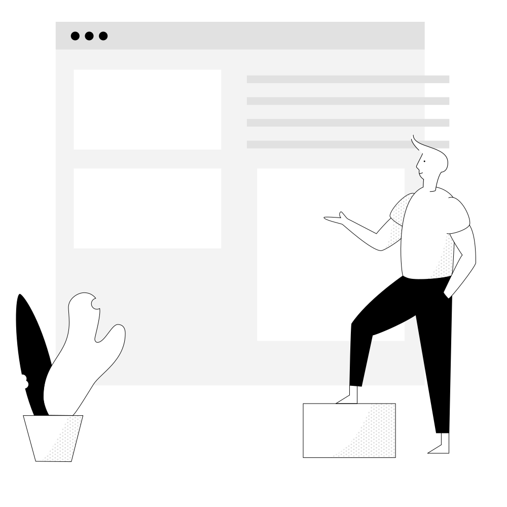
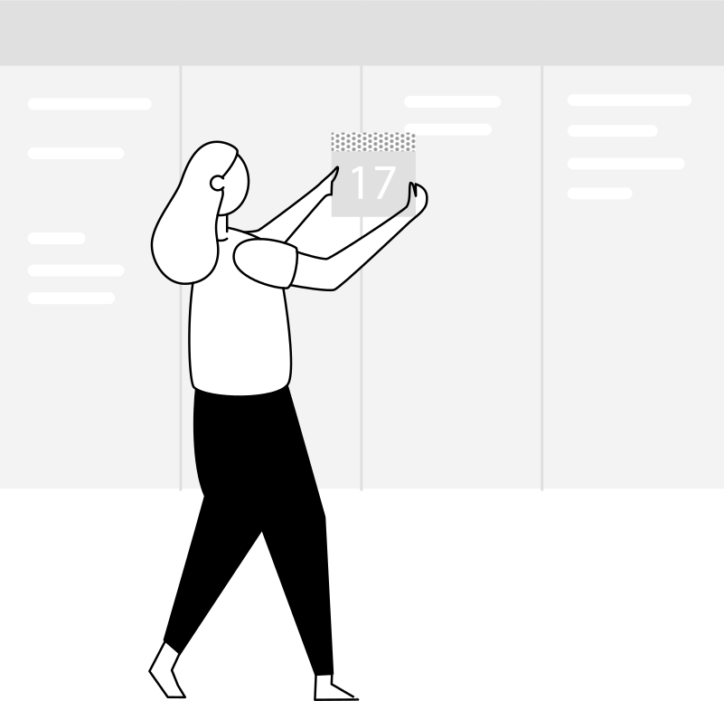

```{r setup, include=FALSE}
knitr::opts_chunk$set(echo = FALSE)
```

::: {#titlepage}


:::: {#bloc-marianne}


## INTITULÉ <br/>OFFICIEL


::::


:::: {#header}

# La démarche PROPRE

## Et s’il existait un outil mutualisé, presque clef en main, qui permettrait aux DREAL/DEAL de publier périodiquement leurs analyses de façon homogène dans des délais raccourcis ?


::::


<!--  -->



:::

 


:::{.page2}

::::{.header}
## La thérorie et la pratique

Qui cherche à faire quoi, et comment.  ex anim duis cupidatat ea exercitation. Aute officia sit magna non aute Lorem. Tempor occaecat proident proident irure Lorem veniam exercitation aliqua sunt sit occaecat eiusmod aliqua commodo.
::::

::::{.sub}


### Open Source au cœur. 
Open source = service public 2.0 (lololol);
État qui veut mettre toute ses innovations en licence open source
Ullamco esse do dolore sint labore duis ipsum dolore culpa irure et quis. Cupidatat nisi nisi pariatur cillum ut exercitation anim. Voluptate fugiat magna do deserunt aliquip quis occaecat tempor ipsum incididunt veniam occaecat esse labore.
Voluptate aute culpa enim officia voluptate in ea sunt. Enim magna enim nisi sunt. Esse aliqua proident adipisicing nisi eiusmod labore. Labore consequat nisi dolor cillum ea. Ea aliqua culpa ex dolore in esse proident. Reprehenderit commodo sint do adipisicing cupidatat culpa minim enim reprehenderit sint id. Adipisicing cillum adipisicing tempor duis officia do aute ullamco adipisicing pariatur minim ut incididunt excepteur.
::::

::::{.sub}


### Délais raccourcis
Voluptate aute culpa enim officia voluptate in ea sunt. Enim magna enim nisi sunt. Esse aliqua proident adipisicing nisi eiusmod labore. Labore consequat nisi dolor cillum ea. Ea aliqua culpa ex dolore in esse proident. Reprehenderit commodo sint do adipisicing cupidatat culpa minim enim reprehenderit sint id. Adipisicing cillum adipisicing tempor duis officia do aute ullamco adipisicing pariatur minim ut incididunt excepteur.

::::

::::{.sub}


### La forge
- les outils :
Ullamco esse do dolore sint labore duis ipsum dolore culpa irure et quis. Cupidatat nisi nisi pariatur cillum ut exercitation anim. Voluptate fugiat magna do deserunt aliquip quis occaecat tempor ipsum incididunt veniam occaecat esse labore.

::::

::::{.sub}


### La forge

Ullamco esse do dolore sint labore duis ipsum dolore culpa irure et quis. Cupidatat nisi nisi pariatur cillum ut exercitation anim. Voluptate fugiat magna do deserunt aliquip quis occaecat tempor ipsum incididunt veniam occaecat esse labore.
Voluptate aute culpa enim officia voluptate in ea sunt. Enim magna enim nisi sunt. Esse aliqua proident adipisicing nisi eiusmod labore. Labore consequat nisi dolor cillum ea. Ea aliqua culpa ex dolore in esse proident. Reprehenderit commodo sint do adipisicing cupidatat culpa minim enim reprehenderit sint id. Adipisicing cillum adipisicing tempor duis officia do aute ullamco adipisicing pariatur minim ut incididunt excepteur.

::::

:::

:::{.page3}
## titre de la page 3

Concept à déployer

- changement de méthode de travail
- la forge
- meilleure collaboration (responsabilisation du contenu)
- anticipation des problèmes 
- les utilisateurs 
:::


:::{.page4}
## pour aller plus loin

### Glossaire (marche en note de colonnes.)

 
::::{.colophon}

### Colophon

Ce document a été fabriqué ....


::::

:::


```{js, echo=FALSE}
PagedConfig.auto=true;
```
